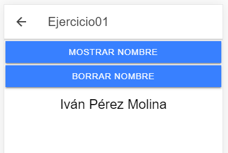
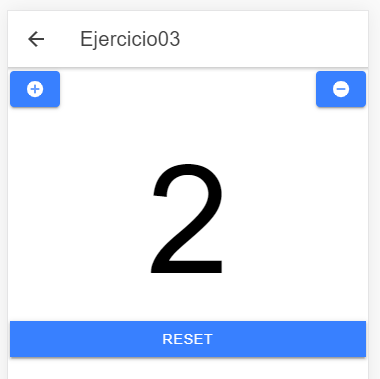
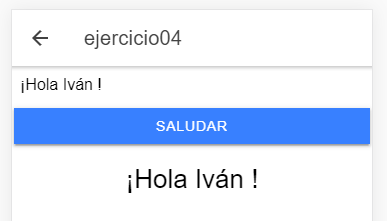
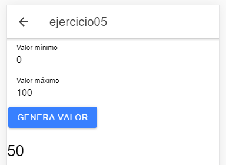
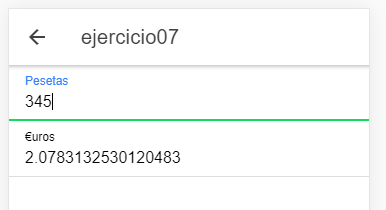

# Ejercicios básicos de Ionic

En este proyecto se realizan 7 ejercicios básicos en Ionic

## Ejercicio 1

En este ejercicio vemos dos bótones, uno nos muestra un nombre y otro nos lo borra de pantall

## Ejercicio 2

⚠⚠ PROBLEMAS TÉCNICOS ⚠⚠

## Ejercicio 3

En este ejercicios podemos ver un contador, el cual cuenta con un reset que pone su valor a 0

## Ejercicio 4

En este ejercicio, el programa nos saluda una vez le proporcionemos nuestro nombre

## Ejercicio 5

Este programa nos genera un valor aleatorio entre dos números indicados por el usuario

## Ejercicio 6

⚠⚠ PROBLEMAS TÉCNICOS ⚠⚠

## Ejercicio 7

Vemos un típico conversor de euros a pesetas y viceversa

Si te ha resultado útil, se agradece una ⭐
